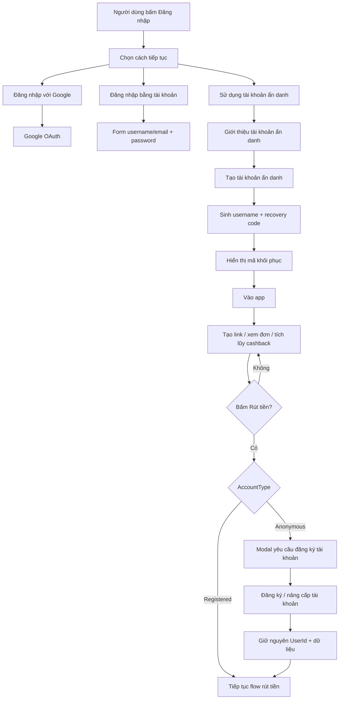

# CatBack – SPEC BA/DEV HANDOFF

**Feature:** Đăng nhập đa lựa chọn + Tài khoản ẩn danh + Mã khôi phục + Nâng cấp tài khoản để rút tiền  
**Phiên bản:** v2  
**Trạng thái:** Ready for Dev sau khi PO/BA xác nhận các mục “Cần xác nhận” ở cuối tài liệu  
**Phạm vi UI tham chiếu:** thư mục `screens/` trong cùng package

---

# 1. Tóm tắt cách hiểu

CatBack cần bổ sung cơ chế cho phép người dùng sử dụng ứng dụng mà không bắt buộc đăng ký tài khoản ngay từ đầu.

Khi người dùng bấm **Đăng nhập**, hệ thống không đi thẳng vào form đăng nhập hiện tại mà mở màn hình **Chọn cách tiếp tục** với đúng 3 lựa chọn:

1. **Đăng nhập với Google**
2. **Đăng nhập bằng tài khoản**
3. **Sử dụng tài khoản ẩn danh**

Nếu chọn **Đăng nhập bằng tài khoản**, hệ thống mở form đăng nhập username/email + password hiện có.

Nếu chọn **Sử dụng tài khoản ẩn danh**, hệ thống tạo một tài khoản ẩn danh tự động, sinh username ngẫu nhiên, gắn với thiết bị hiện tại và tạo **Mã khôi phục**. Người dùng có thể tiếp tục sử dụng các chức năng tạo link, theo dõi đơn hàng và tích lũy cashback.

Tài khoản ẩn danh **không được rút tiền**. Khi bấm **Rút tiền**, hệ thống yêu cầu nâng cấp tài khoản ẩn danh thành tài khoản chính thức. Việc nâng cấp phải giữ nguyên `UserId`, số dư, link đã tạo, lịch sử đơn hàng, cashback và các dữ liệu liên quan.

---

# 2. Mục tiêu nghiệp vụ

- Giảm rào cản đăng ký trước khi người dùng trải nghiệm CatBack.
- Cho phép người dùng bắt đầu sử dụng app nhanh bằng tài khoản ẩn danh.
- Giảm tỷ lệ rời bỏ tại màn hình đăng nhập/đăng ký.
- Vẫn bảo đảm khả năng khôi phục tài khoản thông qua **Mã khôi phục**.
- Buộc người dùng đăng ký tài khoản chính thức trước khi thực hiện nghiệp vụ tài chính nhạy cảm là **Rút tiền**.
- Tránh phát sinh nghiệp vụ merge dữ liệu giữa tài khoản ẩn danh và tài khoản chính thức bằng cách giữ nguyên `UserId` khi nâng cấp.

---

# 3. Phạm vi

## 3.1 Trong phạm vi

- Màn hình chọn phương thức đăng nhập.
- Đăng nhập Google.
- Đăng nhập bằng username/email + password hiện có.
- Tạo tài khoản ẩn danh.
- Sinh username tự động.
- Sinh mã khôi phục.
- Ghi nhớ thiết bị.
- Màn hình hiển thị mã khôi phục sau khi tạo tài khoản.
- Khôi phục tài khoản bằng mã khôi phục.
- Hồ sơ cho tài khoản ẩn danh.
- Cho phép đổi username đối với tài khoản ẩn danh.
- Yêu cầu nâng cấp tài khoản khi rút tiền.
- Nâng cấp tài khoản ẩn danh thành tài khoản chính thức.
- Giữ nguyên dữ liệu/số dư khi nâng cấp.
- Đăng xuất thông thường.
- Đăng xuất và quên thiết bị này.

## 3.2 Ngoài phạm vi hiện tại

- KYC/eKYC.
- Xác minh ngân hàng nâng cao.
- Multi-device management đầy đủ.
- Passkey/WebAuthn.
- Login bằng OTP SMS.
- Device fingerprinting.
- MAC Address identification.

---

# 4. Actor

| Actor | Mô tả |
|---|---|
| Guest | Người dùng chưa có session đăng nhập |
| Anonymous User | Người dùng có tài khoản ẩn danh, chưa đăng ký tài khoản chính thức |
| Registered User | Người dùng đã có tài khoản chính thức |
| System | Backend CatBack / Authentication / Wallet / Order / Link |

---

# 5. Trạng thái tài khoản

Đề xuất dùng một `User` duy nhất và phân loại theo `AccountType`.

```csharp
public enum AccountType
{
    Anonymous = 0,
    Registered = 1
}
```

## 5.1 Anonymous

- Có `UserId`.
- Có username hệ thống sinh tự động.
- Có thể đổi username.
- Không bắt buộc email/password.
- Có mã khôi phục.
- Có thể được ghi nhớ trên thiết bị.
- Có thể tạo link / xem đơn / nhận cashback.
- Không được rút tiền.

## 5.2 Registered

- Giữ nguyên `UserId` khi nâng cấp từ anonymous.
- Có thông tin đăng nhập chính thức.
- Được rút tiền khi đáp ứng các điều kiện nghiệp vụ khác của ví.

---

# 6. User flow tổng thể



---

# 7. Chi tiết màn hình

## 7.1 Màn hình chọn cách tiếp tục

**UI tham chiếu:** `screens/01_login_choice_v2.png`

### Nội dung

- Header CatBack giữ nguyên style app hiện tại.
- Tiêu đề: **Chọn cách tiếp tục**.
- 3 option card:
  - Đăng nhập với Google.
  - Đăng nhập bằng tài khoản.
  - Sử dụng tài khoản ẩn danh.
- Note: tài khoản ẩn danh có mã khôi phục.

### Hành vi

| Action | Kết quả |
|---|---|
| Bấm Đăng nhập với Google | Gọi flow Google OAuth |
| Bấm Đăng nhập bằng tài khoản | Mở form login username/email + password hiện tại |
| Bấm Sử dụng tài khoản ẩn danh | Mở màn giới thiệu anonymous |
| Bấm Quay lại | Quay về màn trước |

### Acceptance Criteria

- AC01: Chỉ hiển thị đúng 3 lựa chọn nêu trên.
- AC02: Không hiển thị form username/password ngay tại màn này.
- AC03: Option card phải bấm được toàn bộ card, không chỉ text/icon.
- AC04: Thiết kế mobile-first, không overflow ở width 375px.

---

## 7.2 Màn giới thiệu tài khoản ẩn danh

**UI tham chiếu:** `screens/02_anonymous_intro.png`

### Nội dung

- Không cần đăng ký ngay.
- Tự lưu trên thiết bị hiện tại.
- Có mã khôi phục để dùng lại sau này.
- Cảnh báo về việc xóa dữ liệu trình duyệt.

### Hành vi

| Action | Kết quả |
|---|---|
| Tạo tài khoản ẩn danh | Gọi API tạo anonymous account |
| Tôi muốn đăng ký tài khoản | Chuyển sang flow đăng ký chính thức |
| Quay lại | Quay lại màn chọn cách tiếp tục |

### Acceptance Criteria

- AC05: Button tạo anonymous phải disable khi đang xử lý để tránh tạo nhiều tài khoản.
- AC06: Nếu API tạo thất bại, hiển thị lỗi và cho retry.
- AC07: Nếu đã có anonymous account hợp lệ trên thiết bị, backend phải xử lý theo rule chống tạo trùng.

---

## 7.3 Màn tạo anonymous thành công + mã khôi phục

**UI tham chiếu:** `screens/03_anonymous_success_recovery_code.png`

### Dữ liệu hiển thị

- Username tạm thời.
- Badge “Ẩn danh”.
- Recovery code.
- Nút Sao chép.
- Nút Lưu ảnh.
- CTA xác nhận đã lưu mã.
- CTA tiếp tục vào app.

### Business Rule

- Recovery code phải đủ entropy, không tuần tự, không dễ đoán.
- Không log recovery code ở application log.
- Nếu lưu DB, chỉ lưu hash nếu có thể.
- Recovery code chỉ dùng để khôi phục account, không được coi là username/password thông thường.

### Acceptance Criteria

- AC08: Recovery code hiển thị rõ, có thể copy.
- AC09: Sau copy hiển thị feedback dạng toast “Đã sao chép mã”.
- AC10: Có thể lưu ảnh/card mã khôi phục.
- AC11: `Tiếp tục vào app` chỉ cho đi tiếp sau khi account/session đã được tạo thành công.

---

## 7.4 Màn khôi phục tài khoản

**UI tham chiếu:** `screens/04_restore_with_recovery_code.png`

### Input

- Recovery code.

### Hành vi

1. Normalize input: trim space, uppercase nếu format không phân biệt hoa/thường.
2. Validate format.
3. Gọi API recovery.
4. Nếu hợp lệ:
   - đăng nhập lại account anonymous;
   - tạo session/refresh token mới;
   - có thể liên kết thiết bị hiện tại.
5. Nếu không hợp lệ:
   - báo lỗi chung, không tiết lộ account có tồn tại hay không.

### Acceptance Criteria

- AC12: Không cho brute-force không giới hạn.
- AC13: Có rate limit theo IP/device/session.
- AC14: Error message dạng chung: “Mã khôi phục không hợp lệ hoặc đã hết hiệu lực.”
- AC15: Recovery thành công phải đưa user về app với đúng UserId cũ.

---

## 7.5 Hồ sơ tài khoản ẩn danh

**UI tham chiếu:** `screens/05_anonymous_profile.png`

### Thành phần

- Username hiện tại.
- Badge “Tài khoản ẩn danh”.
- CTA lớn: **Đăng ký để rút tiền**.
- Đổi username.
- Mã khôi phục.
- Thiết bị hiện tại.
- Trợ giúp.
- Đăng xuất và quên thiết bị này.

### Business Rule

- Anonymous user được đổi username nếu username mới hợp lệ và chưa tồn tại.
- Việc đổi username không thay đổi UserId, wallet, orders, links.
- CTA đăng ký phải luôn hiển thị rõ đối với anonymous account.

---

## 7.6 Màn đăng ký / nâng cấp tài khoản

**UI tham chiếu:** `screens/06_register_upgrade.png`

### Trường dữ liệu

- Username.
- Email.
- Password.
- Confirm Password.
- Checkbox điều khoản.

### Trường hợp 1 – Guest đăng ký mới

Tạo registered account mới theo flow hiện có.

### Trường hợp 2 – Anonymous nâng cấp

Không tạo User mới.

Phải cập nhật User hiện tại:

```text
AccountType: Anonymous -> Registered
UserId: giữ nguyên
Wallet: giữ nguyên
Orders: giữ nguyên
Links: giữ nguyên
Cashback: giữ nguyên
```

### Acceptance Criteria

- AC16: Không tạo duplicate user khi anonymous nâng cấp.
- AC17: Upgrade thành công phải giữ nguyên toàn bộ số dư và dữ liệu lịch sử.
- AC18: Nếu email/username đã tồn tại, báo lỗi rõ ràng.
- AC19: Sau upgrade thành công, session hiện tại vẫn hợp lệ hoặc được refresh tự động.

---

## 7.7 Modal yêu cầu đăng ký khi rút tiền

**UI tham chiếu:** `screens/07_withdraw_requires_registration_modal.png`

### Trigger

Khi `AccountType = Anonymous` và user bấm **Rút tiền**.

### Nội dung bắt buộc

- Bạn cần đăng ký tài khoản.
- Để rút tiền hoàn và bảo vệ số dư, hãy nâng cấp tài khoản.
- Số dư, link đã tạo và lịch sử đơn hàng sẽ được giữ nguyên.

### Action

| Button | Hành vi |
|---|---|
| Đăng ký tài khoản | Mở màn đăng ký/nâng cấp |
| Để sau | Đóng modal |
| Xem mã khôi phục | Mở/hiển thị recovery code |

### Acceptance Criteria

- AC20: Không gọi API withdraw trước khi user registered.
- AC21: Việc chặn phải thực hiện cả frontend và backend.

---

# 8. User Stories

| Code | Title | Description |
|---|---|---|
| US-AUTH-01 | Chọn cách đăng nhập | Là guest, tôi muốn chọn Google, tài khoản thường hoặc anonymous để tiếp tục theo nhu cầu |
| US-AUTH-02 | Đăng nhập bằng tài khoản | Là user đã đăng ký, tôi muốn dùng username/email + password để đăng nhập |
| US-ANO-01 | Tạo tài khoản ẩn danh | Là guest, tôi muốn dùng CatBack ngay mà không phải đăng ký |
| US-ANO-02 | Nhận mã khôi phục | Là anonymous user, tôi muốn có mã khôi phục để đăng nhập lại sau này |
| US-ANO-03 | Khôi phục tài khoản | Là anonymous user, tôi muốn dùng mã khôi phục để lấy lại account |
| US-ANO-04 | Đổi username | Là anonymous user, tôi muốn đổi username mặc định sang username dễ nhớ |
| US-ANO-05 | Nâng cấp tài khoản | Là anonymous user, tôi muốn nâng cấp tài khoản mà không mất dữ liệu |
| US-WAL-01 | Chặn rút tiền anonymous | Là hệ thống, tôi cần yêu cầu đăng ký trước khi rút tiền |

---

# 9. Acceptance Criteria chi tiết theo User Story

## US-AUTH-01

**AC-AUTH-01**  
Given user chưa đăng nhập  
When bấm Đăng nhập  
Then hiển thị đúng 3 lựa chọn: Google / tài khoản / anonymous.

**AC-AUTH-02**  
When user chọn “Đăng nhập bằng tài khoản”  
Then hệ thống mở form login hiện tại.

**AC-AUTH-03**  
When user chọn “Sử dụng tài khoản ẩn danh”  
Then hệ thống mở màn giới thiệu anonymous.

## US-ANO-01

**AC-ANO-01**  
When user xác nhận tạo anonymous account  
Then hệ thống tạo User với `AccountType = Anonymous`.

**AC-ANO-02**  
Then hệ thống sinh username random duy nhất.

**AC-ANO-03**  
Then hệ thống tạo recovery code.

**AC-ANO-04**  
Then hệ thống tạo phiên đăng nhập cho user.

## US-ANO-02

**AC-ANO-05**  
Recovery code phải có action copy.

**AC-ANO-06**  
Recovery code phải có action lưu ảnh hoặc phương án lưu tương đương.

## US-ANO-03

**AC-ANO-07**  
Given recovery code hợp lệ  
When user submit  
Then đăng nhập đúng UserId cũ.

**AC-ANO-08**  
Given recovery code không hợp lệ  
Then không tiết lộ thông tin account.

## US-ANO-05

**AC-UPG-01**  
When anonymous user đăng ký thành công  
Then `UserId` giữ nguyên.

**AC-UPG-02**  
Then số dư giữ nguyên.

**AC-UPG-03**  
Then link/order/cashback lịch sử giữ nguyên.

## US-WAL-01

**AC-WAL-01**  
Given user anonymous  
When bấm rút tiền  
Then không thực hiện withdraw và hiện modal yêu cầu đăng ký.

**AC-WAL-02**  
Backend cũng phải reject request rút tiền nếu account vẫn là Anonymous.

---

# 10. Data model đề xuất

> Đây là đề xuất kỹ thuật để dev review, không bắt buộc giữ nguyên tên bảng/cột.

## 10.1 User

```text
User
- Id
- UserName
- EmailAddress
- PasswordHash
- AccountType
- IsActive
- CreationTime
- ...
```

## 10.2 Anonymous Account / Recovery

Có thể dùng bảng riêng:

```text
AnonymousAccountRecovery
- Id
- UserId
- RecoveryCodeHash
- CreatedAt
- RevokedAt
- LastUsedAt
```

## 10.3 User Device

```text
UserDevice
- Id
- UserId
- DeviceId
- DeviceTokenHash
- CreatedAt
- LastSeenAt
- RevokedAt
```

### Lưu ý

- Không sử dụng MAC address.
- Không coi `DeviceId` là credential duy nhất.
- Nên dùng một secret ngẫu nhiên lưu trong secure cookie / local secure storage tùy nền tảng.

---

# 11. API đề xuất

> Endpoint naming mang tính định hướng.

## 11.1 Tạo anonymous account

`POST /api/account/anonymous`

Response:

```json
{
  "userId": 12345,
  "username": "cat_X7K29F",
  "recoveryCode": "CB-7K29-FX83-MP5Q"
}
```

## 11.2 Khôi phục bằng recovery code

`POST /api/account/anonymous/recover`

Request:

```json
{
  "recoveryCode": "CB-7K29-FX83-MP5Q"
}
```

## 11.3 Đổi username anonymous

`PUT /api/account/anonymous/username`

## 11.4 Nâng cấp tài khoản

`POST /api/account/upgrade`

Request ví dụ:

```json
{
  "username": "hungnt",
  "email": "example@gmail.com",
  "password": "********"
}
```

## 11.5 Quên thiết bị

`DELETE /api/account/device/current`

---

# 12. Validation rules đề xuất

## 12.1 Username

- Trim đầu/cuối.
- Không cho trùng.
- Chỉ cho phép tập ký tự phù hợp với rule hiện tại của hệ thống.
- Anonymous generated username phải unique.

## 12.2 Recovery Code

- Case-insensitive nếu business chấp nhận.
- Có prefix để nhận diện, ví dụ `CB-`.
- Không chứa ký tự dễ nhầm nếu có thể: `O/0`, `I/1`.
- Có rate limit.

## 12.3 Password khi nâng cấp

Theo policy hiện tại của hệ thống ABP/CatBack.

---

# 13. Security rules

- Không dùng MAC ID để định danh user.
- Không lưu password mặc định cho anonymous account.
- Không log raw recovery code.
- Không log raw device secret.
- Backend phải enforce `AccountType` khi rút tiền.
- Rate limit recovery endpoint.
- Có cơ chế revoke recovery code/device token nếu cần.
- “Đăng xuất” và “Đăng xuất và quên thiết bị này” phải là 2 hành vi khác nhau.

---

# 14. Edge cases / rủi ro

| Case | Xử lý đề xuất |
|---|---|
| User bấm tạo anonymous nhiều lần | Disable button khi request đang chạy + idempotency/backend guard |
| Mất mạng khi tạo account | Không hiển thị success khi backend chưa confirm |
| User reload ở màn recovery code | Phải có cách lấy lại recovery code nếu policy cho phép, hoặc cảnh báo trước |
| User xóa cookie/local storage | Cho phép khôi phục bằng recovery code |
| User đổi thiết bị | Dùng recovery code |
| User mất recovery code | Không cam kết khôi phục nếu chưa đăng ký tài khoản chính thức |
| Recovery code bị lộ | Có rủi ro chiếm account; cần rate-limit / revoke / regenerate nếu nghiệp vụ cho phép |
| Username mới bị trùng | Báo lỗi và không update |
| Upgrade lỗi giữa chừng | Transaction, không để account ở trạng thái nửa anonymous/nửa registered |
| User anonymous bấm withdraw qua API trực tiếp | Backend reject |
| Google login trùng email với account có sẵn | Cần rule link/merge rõ ràng |
| Anonymous upgrade bằng email đã tồn tại | Không tự merge nếu chưa có rule xác minh ownership |

---

# 15. Logging / Audit đề xuất

Nên log các event nhưng không log secret:

- AnonymousAccountCreated
- RecoveryAttemptSucceeded
- RecoveryAttemptFailed
- AnonymousUsernameChanged
- AnonymousAccountUpgraded
- DeviceForgotten
- WithdrawBlockedForAnonymous

Audit cần có:

- UserId
- Timestamp
- IP / device metadata ở mức phù hợp chính sách
- Result

Không log:

- Raw RecoveryCode
- Raw password
- Raw device token

---

# 16. Analytics đề xuất

Để đánh giá hiệu quả tính năng:

- Tỷ lệ bấm từng option tại màn login choice.
- Tỷ lệ chọn anonymous.
- Tỷ lệ anonymous hoàn thành tạo account.
- Tỷ lệ anonymous có đơn hàng/cashback.
- Tỷ lệ anonymous nâng cấp thành registered.
- Tỷ lệ nâng cấp tại thời điểm bấm withdraw.
- Tỷ lệ recovery thành công/thất bại.

---

# 17. Dev handoff checklist

## Frontend

- [ ] Tạo màn login choice.
- [ ] Tích hợp Google login.
- [ ] Route về login form hiện tại.
- [ ] Anonymous intro.
- [ ] Anonymous success + recovery code.
- [ ] Copy recovery code.
- [ ] Save recovery card/image.
- [ ] Recovery form.
- [ ] Anonymous profile state.
- [ ] Upgrade CTA.
- [ ] Withdraw registration modal.
- [ ] Loading/error/disabled states.
- [ ] Mobile responsive.

## Backend

- [ ] AccountType.
- [ ] Anonymous account creation.
- [ ] Username generation.
- [ ] Recovery code generation/hash.
- [ ] Device credential.
- [ ] Recovery API.
- [ ] Username update.
- [ ] Upgrade transaction.
- [ ] Withdraw guard.
- [ ] Rate limiting recovery.
- [ ] Audit events.

## QA

- [ ] Test guest -> Google.
- [ ] Test guest -> account login.
- [ ] Test guest -> anonymous.
- [ ] Test recovery code.
- [ ] Test logout/relogin.
- [ ] Test forget device.
- [ ] Test anonymous withdraw blocked.
- [ ] Test upgrade keeps balance/history.
- [ ] Test duplicate username/email.
- [ ] Test invalid/reused recovery code behavior.

---

# 18. Cần xác nhận trước khi Ready for Dev hoàn toàn

1. **Recovery code có được dùng nhiều lần không?**  
   Đề xuất: cho dùng nhiều lần cho đến khi user regenerate/revoke, hoặc chuyển thành registered.

2. **Sau khi nâng cấp thành Registered, recovery code anonymous còn hiệu lực không?**  
   Đề xuất: revoke để tránh giữ một backdoor đăng nhập không cần password.

3. **Anonymous user có bắt buộc xác nhận “Tôi đã lưu mã” mới được tiếp tục không?**  
   Đề xuất: không bắt buộc cứng, nhưng hiển thị warning rõ.

4. **Có cho regenerate recovery code không?**  
   Đề xuất: có tại Hồ sơ, và revoke code cũ.

5. **Google login nếu email trùng account registered hiện tại xử lý thế nào?**  
   Cần dùng rule hiện có của hệ thống.

6. **Anonymous nâng cấp có bắt buộc email verification không?**  
   Cần PO/BA xác nhận theo policy tài khoản hiện tại.

7. **Rút tiền ngoài điều kiện Registered còn yêu cầu gì khác?**  
   Ví dụ: email verified, thông tin ngân hàng, số dư tối thiểu.

---

# 19. Definition of Done

Feature được coi là hoàn tất khi:

- UI khớp bộ thiết kế trong `screens/`.
- Có đúng 3 option tại màn login choice.
- Anonymous account tạo được và có recovery code.
- Khôi phục account trả về đúng UserId cũ.
- Anonymous không thể rút tiền cả ở frontend lẫn backend.
- Upgrade không làm thay đổi UserId và không mất dữ liệu.
- Các edge case chính được QA test.
- Không lộ secret trong log.
- BA/PO xác nhận các mục “Cần xác nhận”.
